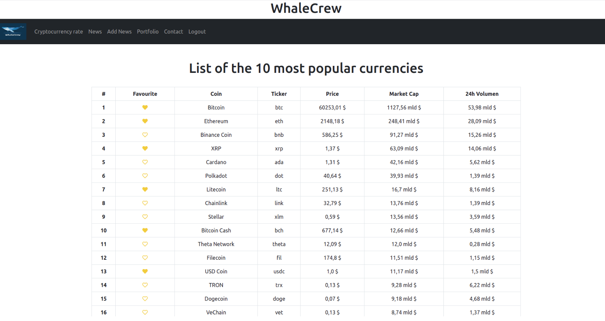
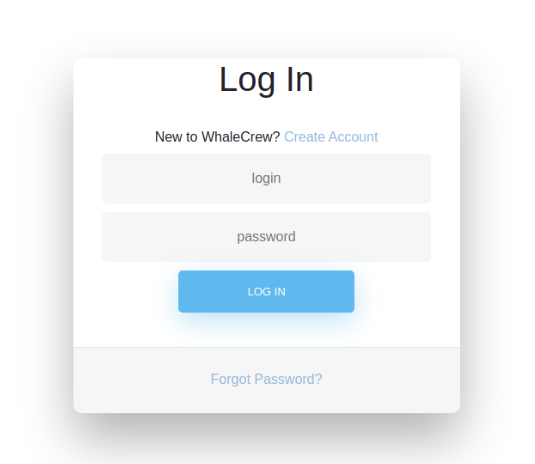
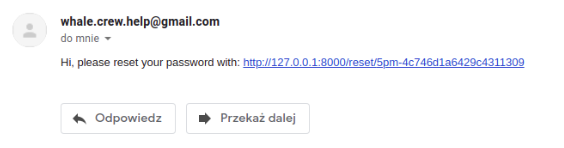
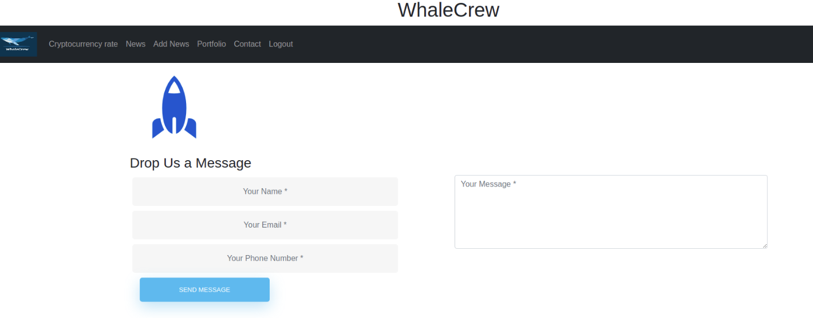
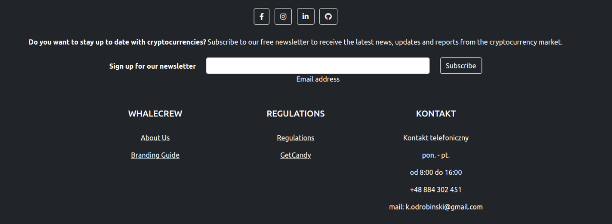
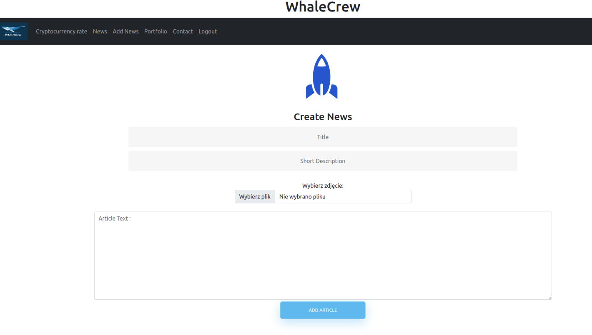
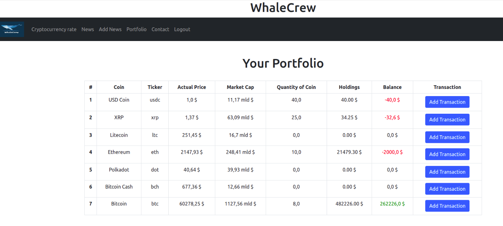

# WhaleCrew
In general, this Django app might be the website for users and holders of cryptocurrencies. In particular, the app was created for the final project od CodersLAB - programming school. That's why you may find here few customized elements, like the logo on the home page which you can see on the screenshot below.

## Start

To start exploring the project:
1. Clone this repository
2. Create the virtual environment and install requirements from 'requirements.txt'
3. Configure the SMTP mail server in settings
4. Configure a database - in the project directory you need to create the file named ***local_settings.py*** and add there DATABASES with details of the database connection.
   These details will be imported by Django as in the file `setting.py`.
4. Run the command `python manage.py migrate`
5. Create a superuser to access the admin site: ` python manage.py createsuperuser`
6. That's all, run `python manage.py runserver` and enjoy the app :-)

### About
Cryptocurrencies page
### Main page:
You can see there a list of crypto coin with all of their informations downloaded with the binance api and coingecko api.
Authorized user also can see the favourite column in the table. 

### Log in Page:
New user can create the profile, can remaind password and log in. 

### Forget Password Page:
By using the password reminder, the user will receive an e-mail with a unique link to change the password by entering his e-mail

### Contact Page:
By using this page you can contact with me. 

### Footer:
Footer includes the information about page and me. You can also sign up to newsletter.

### News Page:
By using this page user(if User has got the permission) can create article. Also this page show all of created Articles.

### Portfolio Page:
The user can create his portfolio by add crypto coin to favourite on the indexpage. Next can add the transaction and see his balance.

## The end
Thank you for your interest.
